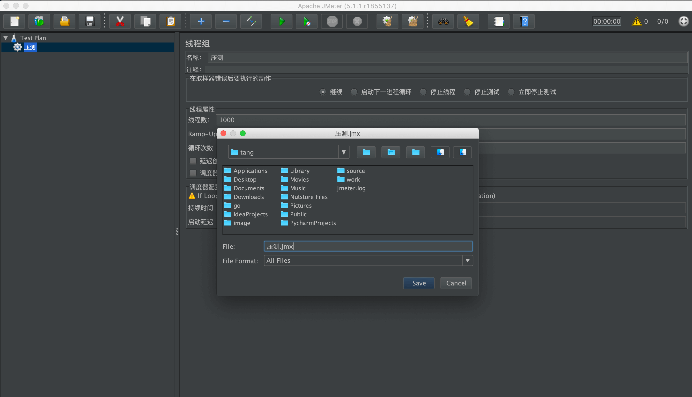
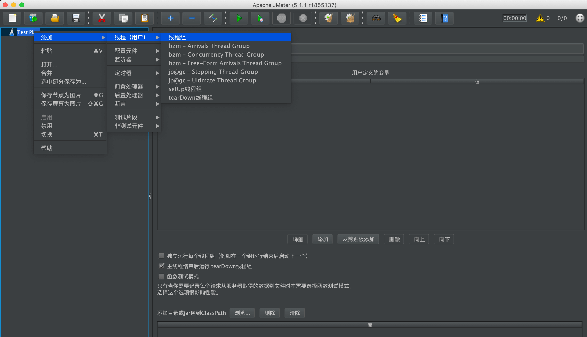
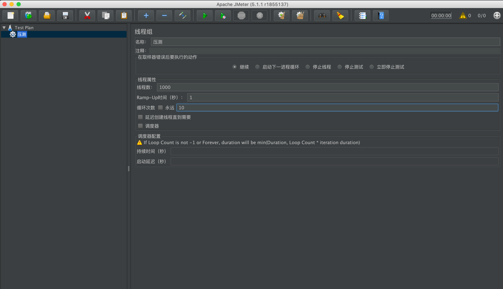
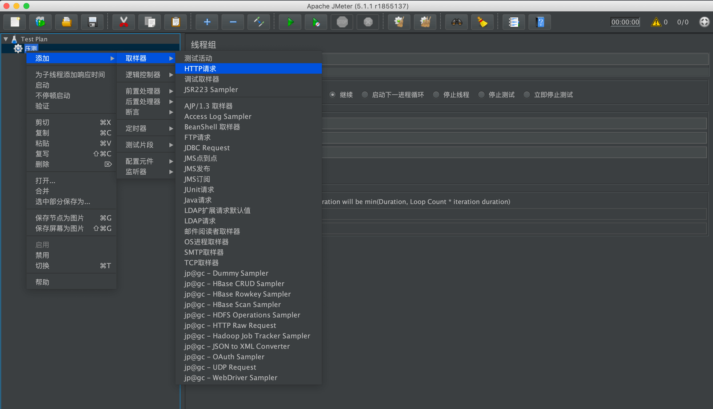
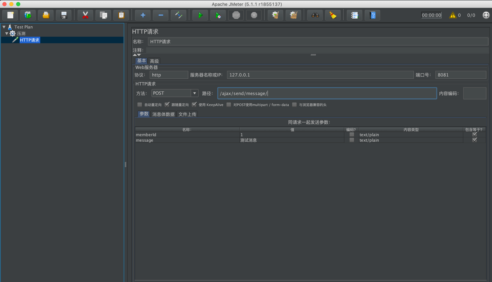
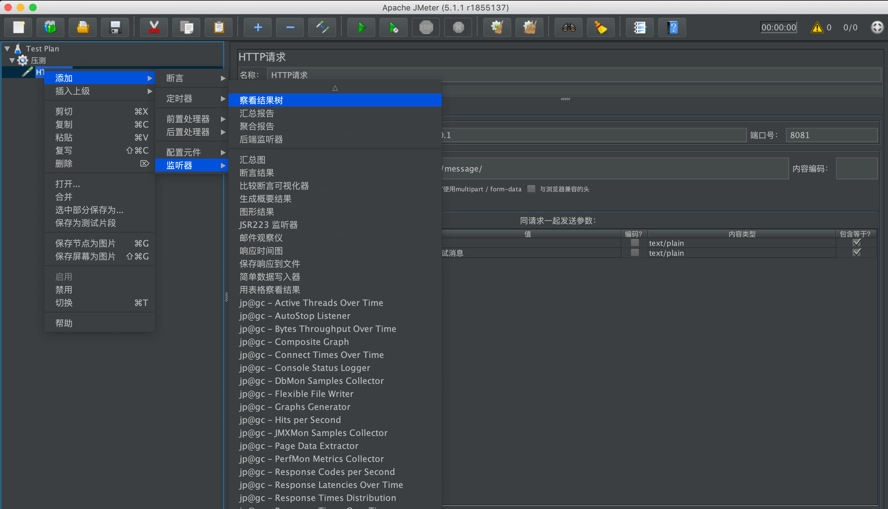
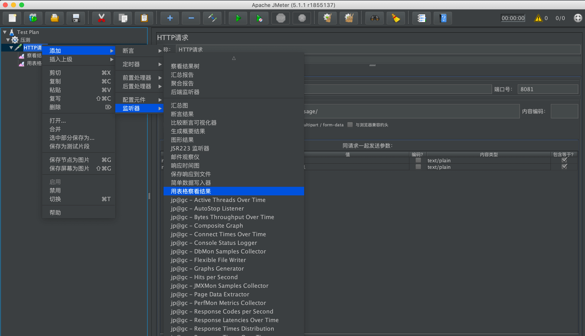
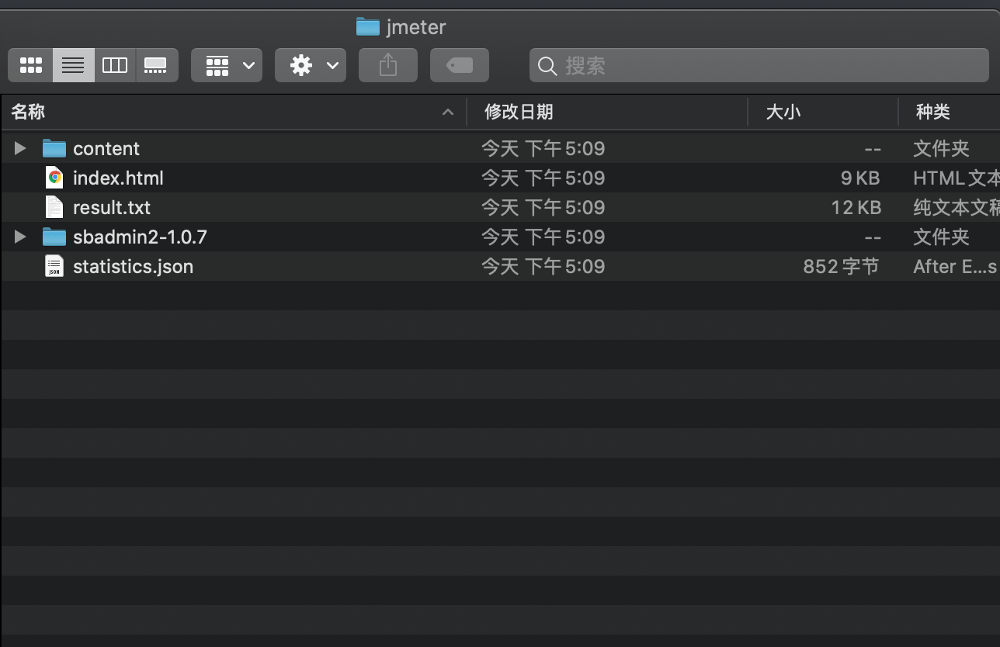
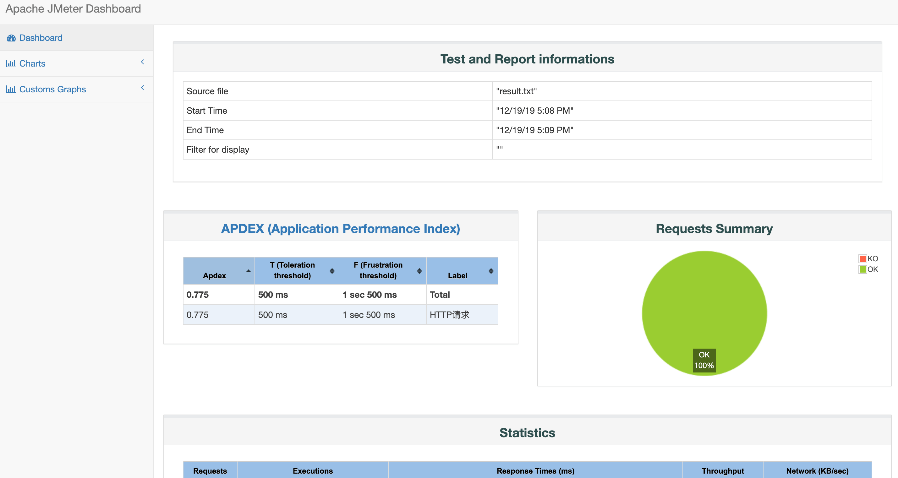

## jmeter压力测试

> 注意：需在安装jdk的环境下操作

Apache JMeter是Apache组织开发的基于Java的压力测试工具。用于对软件做压力测试，它最初被设计用于Web应用测试，但后来扩展到其他测试领域。 

<!-- more --> 

### mac

* 安装
```
brew install jmeter

路径：/usr/local/Cellar/jmeter/5.0
```

* 启动
```
open /usr/local/bin/jmeter
```

### windows

* 下载地址：https://mirrors.tuna.tsinghua.edu.cn/apache/jmeter/binaries

* 安装：直接将下载好的zip压缩包进行解压即可。
* 启动：进入bin目录，找到jmeter.bat文件，双机打开即可启动。


### 使用
#### 1、修改主题和语言

默认的语言是英语，这样不太方便使用，所以需要修改下中文语言。

通过【Options】-> 【Choose Language】变更简体中文


中文简体语言修改完成。 

#### 2、创建首页的测试用例

第一步：保存测试用例



第二步：添加线程组，使用线程模拟用户的并发





1000个线程，每个线程循环10次，也就是tomcat会接收到10000个请求。

第三步：添加http请求，并设置相关端口、请求路径及参数





第四步：添加查看结果树，与用表格查看结果





#### 3、启动、进行测试 

注意：启动时终端提示不要使用图形化界面执行测试计划，需要在终端使用命令执行

> Don't use GUI mode for load testing !, only for Test creation and Test debugging.
>
> For load testing, use CLI Mode (was NON GUI):
>
>   jmeter -n -t [jmx file] -l [results file] -e -o [Path to web report folder]
>
> & increase Java Heap to meet your test requirements:
>
>   Modify current env variable HEAP="-Xms1g -Xmx1g -XX:MaxMetaspaceSize=256m" in the jmeter batch file
>
> Check : https://jmeter.apache.org/usermanual/best-practices.html

执行命令：

```sh
jmeter -n -t SendMessage.jmx -l jmeter/result.txt -e -o jmeter/

# SendMessage.jmx 测试文件路径
# jmeter/result.txt 测试结果文件路径
# jmeter/ web报告保存路径
```

命令执行结束后在指定路径会出现对应的报告，打开index.html可查看报告



#### 4、查看web报告

